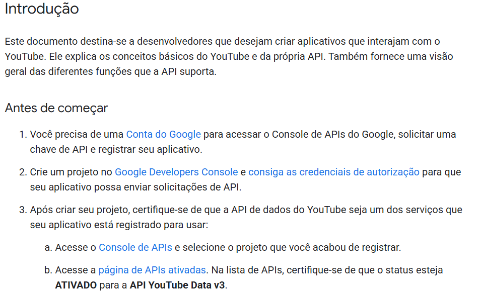

<h1 align="center"> Api Projeto Youtube Clone </h1>

<p align="center">
API do Projeto Youtube Clone desenvolvido no curso Profissão Programador (Full-Stack)
</p>

<p align="center">
  <a href="#desktop_computer-tecnologias">Tecnologias</a>&nbsp;&nbsp;&nbsp;|&nbsp;&nbsp;&nbsp;
  <a href="#books-bibliotecas">Bibliotecas</a>&nbsp;&nbsp;&nbsp;|&nbsp;&nbsp;&nbsp;
  <a href="#wrench-pré-Requisitos">Pré-Requisitos</a>&nbsp;&nbsp;&nbsp;|&nbsp;&nbsp;&nbsp;
  <a href="#clipboard-instruções">Instruções</a>&nbsp;&nbsp;&nbsp;|&nbsp;&nbsp;&nbsp;
  <a href="#api-usage">API Usage</a>
</p>

<br>

<p align="center">
  Api para projeto do youtube clone desenvolvido no curso full-stack <b>Profissão Programador</b>, com o professor Paulo Borges.
</p>

<p align="center">
  Uma interface parecida com o YouTube, criada como um "clone", com algumas funções que imitam o site original. A página inicial tem a opção de login e mostra cards com vídeos e shorts, que podem ser filtrados por categoria. Há também uma área do canal do usuário, onde é possível adicionar cards com informações dos vídeos. Cada card mostra apenas a imagem, o título, a descrição, a data de publicação e o número de visualizações. 
</p>

<p>
  Há consumo de 2 api's neste projeto:   </br>  
    1. Api própria que contém as rotas para criação e login de usuários, bem como rotas para criação de vídeos dos usuários.   </br>
    2. Api do youtube consumida dentro de rotas da primeira api, para pesquisa de vídeos por categoria ou por pesquisa de palavras, é necessário uma chave para acesso dessa api do youtube.
</p>

## :desktop_computer: Tecnologias 

Esse projeto foi desenvolvido com as seguintes tecnologias:

- MariaDB
- Typescript

## :books: Bibliotecas
Principais Bibliotecas utilizadas:
- Express
- Jsonwebtoken, uuid
- Styled components

## :wrench: Pré-Requisitos
Para utilizar a api você precisará ter instalado em sua máquina:
- NodeJs
- MariaDb
- MySql Workbench (opcional) </br>
  *Para criar o banco de dados e para visualizar as tabelas de usuários e vídeos*

## :clipboard: Instruções
1. Clone o repositório:

```
❯ git clone https://github.com/Gustavo-Dourado/api_youtube_project
```

2.Navege para a pasta do projeto:

```
❯ cd api_youtube_project
```

2.Instale as dependências do projeto:

```
❯ npm install
```

3. Gerar API Key do youtube conforme instruções do site: [Google](https://developers.google.com/youtube/v3/getting-started?hl=pt-br) </br>

- Prévia das instruções para criação da API Key do youtube:
<p>
  
</p>


4. Criação do banco de dados no mariaDb

5.Configurar o arquivo .env </br>
*Configurar .env conforme arquivo env.example:*
```
SECRET=secret

USER_DATABASE=username
PASSWORD_DATABASE=password
DATABASE=databasename
HOST_DATABASE=localhost 
PORT_DATABASE=3306 


YOUTUBE_API_KEY=XXxxXxxxxx_x999XX99XXXXXx9xxxXXXx9xxXx
```

6. Gerar build do projeto:

```
❯ npm run build
```

7. Criar tabelas do projeto:

```
❯ npm run db:init
```

8. Iniciar servidor:

```
❯ npm run start
```
## API Usage

As seguintes rotas estão disponíveis:

1. `POST api/user/sign-up` - Cadastro de novo usuário
```
{ 
    "name": "name",
    "email": "name@hotmail.com",
    "password":  "password"
}
```

2. `POST api/user/sign-in` - Login de usuário
```
{ 
    "email": "name@hotmail.com",
    "password":  "password"
}
```

3. `GET api/user/get-user` - Buscar informações do usuário </br>
*Informações para apresentar resultados nas páginas home, userChannel, etc.* </br>
*É necessário passer token (string) de acesso nesta rota no header da requisição* 
```
{headers: {Authorization: token}}
```

4. `GET api/videos/search-category?categoryId=0` - Pesquisar vídeos na api do Youtube por CATEGORIA </br>
*(Categoria determinada por número e passada por query params)*

5. `GET api/videos/search?searchContent="nome"` - Pesquisar vídeos na api do Youtube por NOME </br>
*(Pesquisa passada por query params)*

6. `GET api/videos/get-videos?user_id=user_id` - Buscar vídeos do usuário </br>
*(user_id passado por query params)* </br>

*É necessário passer token (string) de acesso nesta rota no header da requisição* 
```
{headers: {Authorization: token}}
```

7. `POST api/videos/create-video` - Criar vídeo de usuário
```
{headers: {Authorization: token}}

{
    "user_id": "user_id",
    "image": "https://www.endereco.com/imagem.png",
    "title": "Título Vídeo",
    "description": "Descrição do vídeo aqui",
    "channel": "G",
    "views": "115",
    "upload_date": "2025-06-19"
}
```
---
